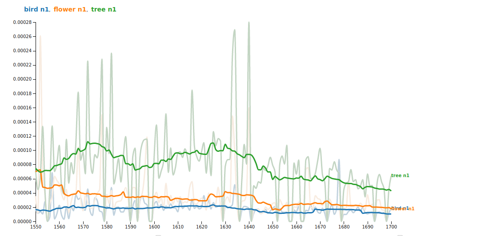

*EarlyPrint* + Python
============================

This [Jupyter Book](https://jupyterbook.org/intro.html) contains a series of Python coding tutorials for working with the [*EarlyPrint*](https://earlyprint.org/) XML corpus. These are meant to be friendly first steps toward computational study of our corpus, and we encourage you to [reach out](https://twitter.com/early_print) with any thoughts or questions.

On the left-hand side of this page are several Python "notebooks." They're ordered roughly by complexity of the code they contain, but one is not necessarily a prerequisite for the next. To make a notebook interactive---in order to modify code and make other changes---use the rocket ship logo at the top of any notebook page and select "Binder."

Happy coding!
